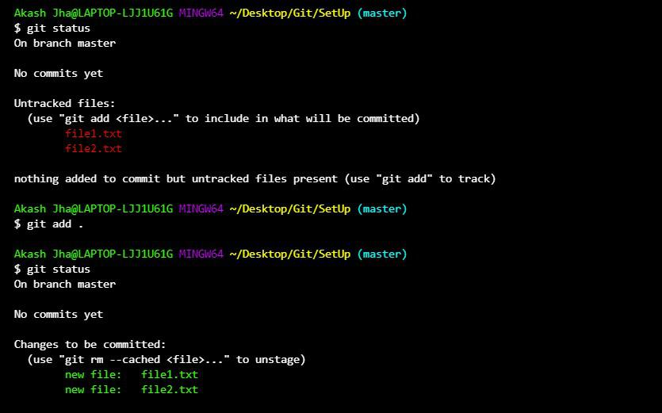
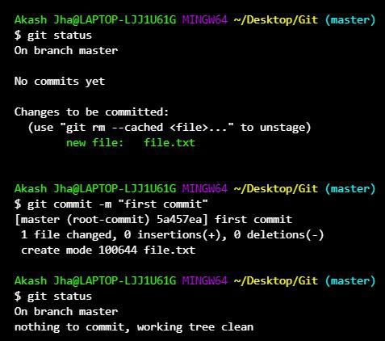
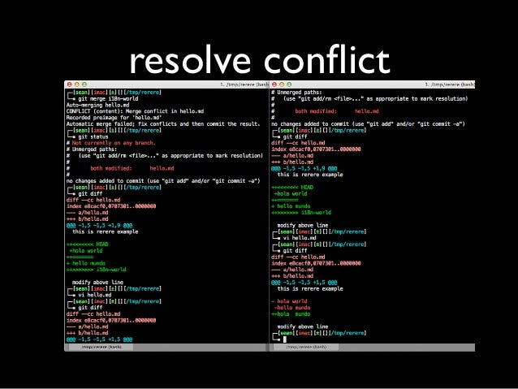

<!--TRABAJO REALIZADO POR FRAN, ALEX, MIGUEL CASADO Y ALFONSO-->


# Conceptos Básicos de Git
| Concepto    | Descripción                                                  |
|-------------|--------------------------------------------------------------|
| Repositorio | Un directorio que contiene todos los archivos y carpetas de un proyecto, junto con la información de seguimiento de cambios. |
| Commit      | Un punto en la historia del repositorio que registra un conjunto de cambios realizados en los archivos. Cada commit tiene un mensaje descriptivo. |
| Branch      | Una línea de desarrollo independiente en el repositorio que permite trabajar en nuevas características o correcciones sin afectar la rama principal. |
| Merge       | La acción de combinar los cambios de una rama en otra, integrando el trabajo realizado en diferentes ramas. |
| Pull/Push   | Operaciones para sincronizar cambios entre repositorios remotos y locales. Pull obtiene los cambios del repositorio remoto y los fusiona con el repositorio local, mientras que push envía los cambios locales al repositorio remoto. |

# Comandos Básicos de Git
| Comando                          | Descripción                                                  |
|----------------------------------|--------------------------------------------------------------|
| `git init`                       | Inicializa un nuevo repositorio Git en el directorio actual.|
| `git clone <URL>`                | Clona un repositorio Git existente en el directorio local.  |
| `git add <archivo>`              | Agrega cambios de archivos al área de preparación para ser incluidos en el próximo commit. |
| `git commit -m "Mensaje"`        | Registra los cambios en el repositorio junto con un mensaje descriptivo. |
| `git push`                       | Envía los cambios locales al repositorio remoto.            |
| `git pull`                       | Obtiene los cambios del repositorio remoto y los fusiona con el repositorio local. |
| `git branch`                     | Lista todas las ramas del repositorio.                      |
| `git checkout <rama>`            | Cambia a la rama especificada.                              |
| `git merge <rama>`               | Fusiona los cambios de la rama especificada en la rama actual. |


# Agregar y confirmar cambios en un repositorio local de Git


Para agregar y confirmar cambios en un repositorio local de Git, sigue estos pasos:


1. **Verificar el estado de los archivos modificados:**
   Antes de agregar los cambios, es útil verificar qué archivos han sido modificados y en qué estado se encuentran. Puedes usar el comando `git status` para ello.


2. **Agregar archivos modificados al área de preparación:**
   Utiliza el comando `git add` seguido del nombre de los archivos que deseas agregar al área de preparación. Por ejemplo:
   ```bash
   git add archivo_modificado.txt
   ````


3. **Confirmar cambios en un repositorio local:**
    Utiliza el comando `git commit` seguido de un mensaje descriptivo de los cambios realizados. Por ejemplo:
    ```bash
    git commit -m "Agregando archivo_modificado.txt"
    ```
### IMAGEN GIT ADD



### IMAGEN GIT COMMIT


### RESUMEN DE LO QUE HACE CADA COMANDO

| Comando    | Descripción                                                   |
|------------|---------------------------------------------------------------|
| git add    | Agrega cambios de archivos específicos al área de preparación.|
| git commit | Guarda los cambios confirmados en el repositorio.             |

# Resolución de conflictos de merge

## Paso 1: Identificar conflictos
Al realizar un merge entre dos ramas en un repositorio de Git, es posible que surjan conflictos cuando los cambios en ambas ramas afectan a las mismas líneas de código o archivos.

## Paso 2: Abrir el archivo en conflicto
Abre el archivo en conflicto en un editor de texto o en un entorno de desarrollo integrado (IDE). Los conflictos se marcarán claramente en el archivo.


## Paso 3: Resolver conflictos
Dentro del archivo en conflicto, busca las siguientes secciones. Estas marcan las secciones en conflicto.
## Tabla de Resolución de Conflictos

| Sección en conflicto | Acción a tomar                                      |
|----------------------|------------------------------------------------------|
| <<<<<<<               | Mantener los cambios de la rama actual               |
| =======               | Separador para marcar el inicio y fin de los cambios |
| >>>>>>>               | Mantener los cambios de la rama que se está fusionando |

Para resolver el conflicto, decide qué cambios quieres mantener o combinar de ambas versiones. Elimina las marcas de conflicto y realiza los ajustes necesarios en el código para integrar los cambios de manera coherente.

### IMAGEN CONFLICTOS


